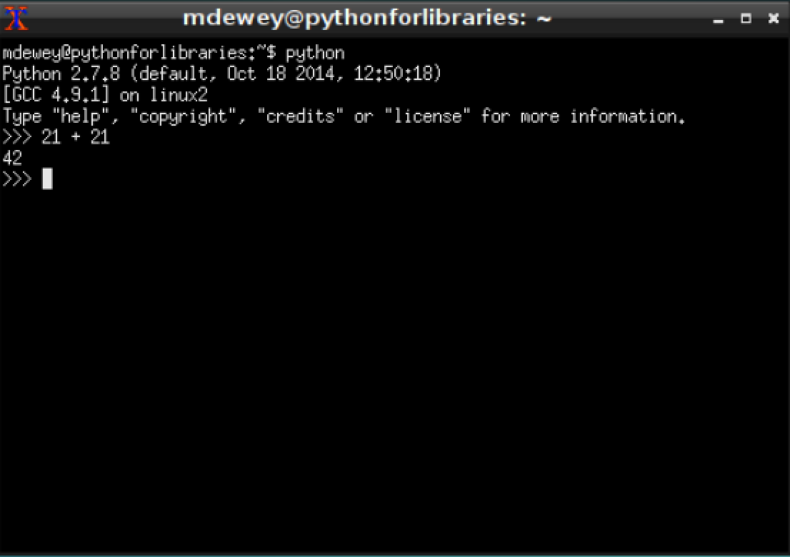

### Programming Basics

We will start with the very basics of programming. Please ensure your virtual machine from the previous two chapters is up and running. Open the XTerm application. If none of this makes sense please revisit the first two chapters to get comfortable. One of Python's most useful tools is the *Interactive Shell*. 

You can start your interactive shell by typing `python` in your XTerm application. 

```bash
python
Python 2.7.8 (default, Oct 18 2014, 12:50:18)
[GCC 4.9.1] on linux2
Type "help", "copyright", "credits" or "license" for more information.
>>>
```

The `>>>` (also chevron prompt) is the interactive shell. Enter *21 + 21* at the prompt and let Python do some simple arithmetic. 

```python
>>> 21 + 21
42
>>>
```

Interactive Shell:


In Python, 21 + 21 is an _expression_, which is the smallest and most basic kind of instruction in the language. Expressions will have _values_ (in this case 21) and will have _operators_ (in this case +) which will _evaluate_ to a single value (in this case 42). Expressions are used anywhere in your code that you could use a value. 

In our second example enter the value *42* with no operators. This is also an expression which just evaluates to itself.

```python
>>> 42
42
```

We have seen the use of the addition operator above. Python uses others that we will demonstrate below.

```python
>>> 2 + 8 * 5
42
>>> (2 + 8) * 5
50
>>> 234567 * 456789
107147625363
>>> 2 ** 4
16
>>> 42 / 5
8
>>> 42.0 / 5
8.4
>>> 42.0 // 5
8.0
>>> 42 % 5
2
>>> (8 - 2) * ((3 + 4.0) / (5 - 2))
14.0
```

All the examples we just entered expressions that Python evaluates to a single value. Python uses the same order of operations as mathematics. The `**` operation is evaluated first; the `*,/,//,` and `%` operators are evaluated next, from left to right; and the `+` and `-` are evaluated last (also from left to right). Parentheses are used to override the usual precedence if you need to. 

The rules for putting operators and values together to form expressions are a key part of Python programming language. The ability to enter these values and operators and values in the interactive shell allows one to test validity of the Python language syntax as we will demonstrate below. 

```python
>>> 41 +
  File "<stdin>", line 1
    41 +
       ^
SyntaxError: invalid syntax
>>>
```

Python here is telling in "almost English" that there we used invalid Syntax. Part of learning how to program is learning how to get comfortable with the numerous errors that you will encounter. In the example above, adding an integer after the `+` operator or eliminating the operator will rid you the error. 

### Integer, Floating-Point and String Data Types

