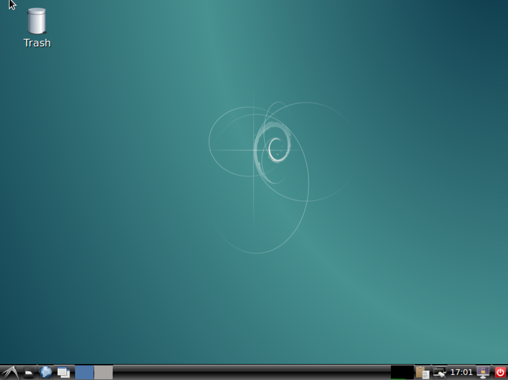
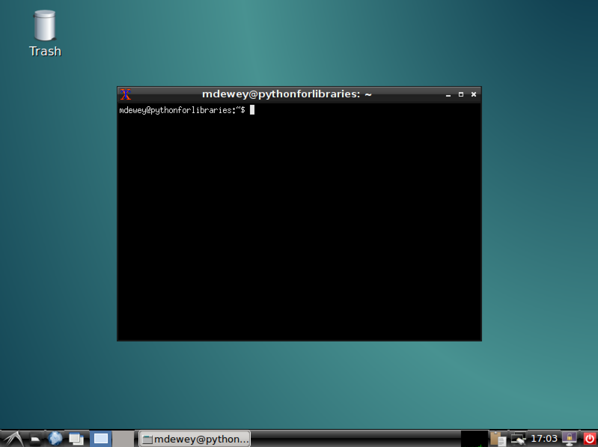
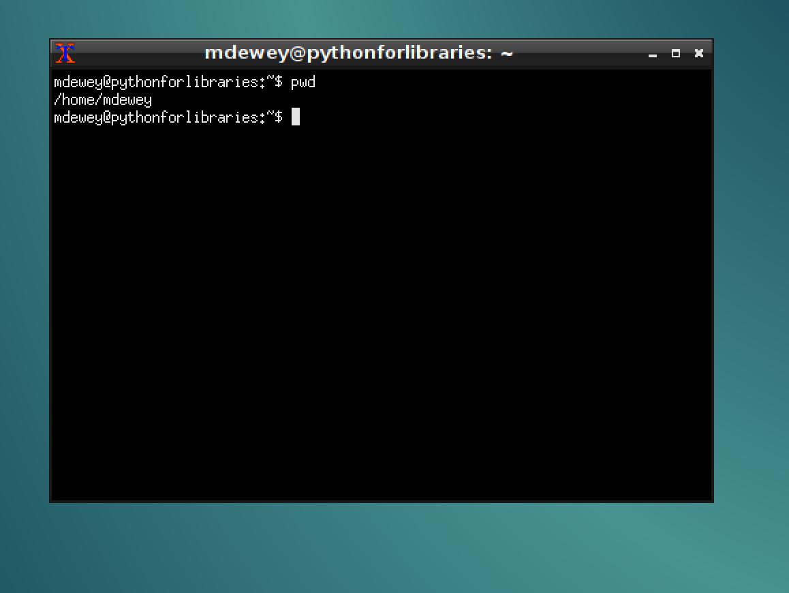

### Virtual Box Introduction

In the last chapter we introduced Virtual Box. Since we will be using this extensively for the rest of the book it is important to get familiar with it. This will be a very basic introduction to starting and using your Debian Linux Virtual Box. If you cannot remember the steps revisit them in the introduction chapter. You will use the same username and password. Upon logon you will see the clear desktop.

Desktop:


Restart the XTerm application like you did in the introduction chapter. 

Xterm Application:


It is in this window that we will spend the rest of the book typing the commands. While this is not a class on the unix commandline. We will walk through some of the steps that we will use throughout the rest of the book. 

* Close the XTerm application by clicking the X at the top right of the application window.
* Open the Application again.

In the this window type the command

```bash
pwd
/home/mdewey
```

Print Working Directory:


This command prints to the terminal window the working directory. 
