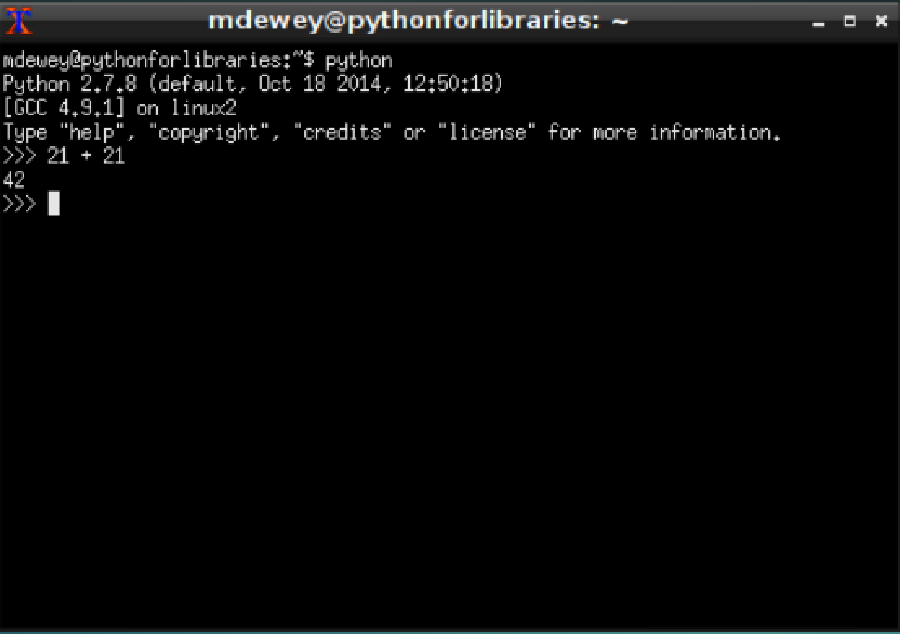
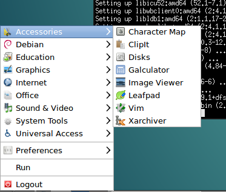
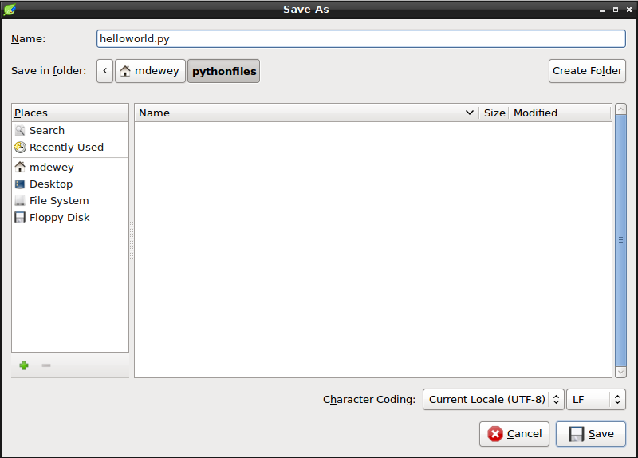

### Programming Basics

We will start with the very basics of programming. Please ensure your virtual machine from the previous two chapters is up and running. Open the XTerm application. If none of this makes sense please revisit the first two chapters to get comfortable. One of Python's most useful tools is the *Interactive Shell*. 

You can start your interactive shell by typing `python` in your XTerm application. 

```bash
python
Python 2.7.8 (default, Oct 18 2014, 12:50:18)
[GCC 4.9.1] on linux2
Type "help", "copyright", "credits" or "license" for more information.
>>>
```

The `>>>` (also chevron prompt) is the interactive shell. Enter *21 + 21* at the prompt and let Python do some simple arithmetic. 

```python
>>> 21 + 21
42
>>>
```

Interactive Shell:


In Python, 21 + 21 is an _expression_, which is the smallest and most basic kind of instruction in the language. Expressions will have _values_ (in this case 21) and will have _operators_ (in this case +) which will _evaluate_ to a single value (in this case 42). Expressions are used anywhere in your code that you could use a value. 

In our second example enter the value *42* with no operators. This is also an expression which just evaluates to itself.

```python
>>> 42
42
```

We have seen the use of the addition operator above. Python uses others that we will demonstrate below.

```python
>>> 2 + 8 * 5
42
>>> (2 + 8) * 5
50
>>> 234567 * 456789
107147625363
>>> 2 ** 4
16
>>> 42 / 5
8
>>> 42.0 / 5
8.4
>>> 42.0 // 5
8.0
>>> 42 % 5
2
>>> (8 - 2) * ((3 + 4.0) / (5 - 2))
14.0
```

All the examples we just entered expressions that Python evaluates to a single value. Python uses the same order of operations as mathematics. The `**` operation is evaluated first; the `*,/,//,` and `%` operators are evaluated next, from left to right; and the `+` and `-` are evaluated last (also from left to right). Parentheses are used to override the usual precedence if you need to. 

The rules for putting operators and values together to form expressions are a key part of Python programming language. The ability to enter these values and operators and values in the interactive shell allows one to test validity of the Python language syntax as we will demonstrate below. 

```python
>>> 41 +
  File "<stdin>", line 1
    41 +
       ^
SyntaxError: invalid syntax
>>>
```

Python here is telling in "almost English" that there we used invalid Syntax. Part of learning how to program is learning how to get comfortable with the numerous errors that you will encounter. In the example above, adding an integer after the `+` operator or eliminating the operator will rid you the error. 

### Integer, Floating-Point and String Data Types

A _data type_ is a category is a category for values, and every value matches to exactly one data type. In the last section we demonstrated how Python expressions evaluate to one value. This value goes into tha various data type that Python has. The three most common ones we will encounter are Integers, Floating-point numbers (sometimes floats) and Strings. The values `42` and `-21` for example are _integer_ values. The integer (sometimes _int_) data type indicates values that are whole numbers. Numbers that have a decimal point such as `3.14` or `2.718` are called floating-point numbers. In our examples earlier we used `42` and `42.0` the former is an integer while the latter is a floating-point number and the differing results demonstrated that. We will address these as we delve further. Finally the last commonly used data type is Strings. Python programs that contain text values are referred to as _strings_. The text characters are surrounded either with double or single quotes. It is only important to remain consistent. The author of this book has used single quotes significantly and you will notice that here. This is a matter of taste. These are some examples of strings `'Hello'` and `'Goodbye Cruel World'`. 

As you get used to using programming one of the syntax errors you will encounter quite a bit early on is the `SyntaxError: EOL` error demonstrated below.

```python
>>> 'Goodbye Cruel World!
  File "<stdin>", line 1
    'Goodbye Cruel World!
                        ^

SyntaxError: EOL while scanning string literal
>>>
```

Once again Python marks the exact spot where it failed to understand what we mean. Learning how to interpret these messages will suit you as you start out.

### String Concatenation and Replication

Python operators meaning vary based on the data types values next to it. As we will see below the `+` is used for addition when next to integers or floating-points values. Start your Python shell and do the following.

```python
>>> 'Monty' + 'Python'
'MontyPython'
```

In the example above Python joins the strings together. This is known as _string concatenation_. The expression evaluates down to a new string value that combines the text of the two strings. When we try to add a string and an integer we will get a _TypeError_ as seen below. 

```python
>>> 'Monty' + 42
Traceback (most recent call last):
  File "<stdin>", line 1, in <module>
TypeError: cannot concatenate 'str' and 'int' objects
```

Once again pay attention to the error message at the very bottom which in _almost_ English tells you what Python interprets what we typed in. In this case Python is telling us it cannot concatenate an integer to the string 'Monty'. Python can convert data types as we will see shortly but as the example above demonstrates it does not do this automatically. 
Earlier we say the `*` operator is used in multiplying two or more integers or floating-point values. In the example below we will see what it does with strings.

```python
'Spam' * 5
'SpamSpamSpamSpamSpam'
```
Here we see the expression evaluates to a single string value that repeats the original value to a number equal to the integer value. 

```python
'Monty' * 'Python'
Traceback (most recent call last):
  File "<stdin>", line 1, in <module>
TypeError: can't multiply sequence by non-int of type 'str'
'Spam' + 2.5
Traceback (most recent call last):
  File "<stdin>", line 1, in <module>
TypeError: cannot concatenate 'str' and 'float' objects
```

In the examples above we learn that the `*` will not multiply strings together and will not concatenate strings with floats.

### Storing Values in Variables

_Variable_ in progamming are best thought of as a location in the computer's memory that stores a value. 

In Python they take the format of 

```python
variable = expression
```

How does a variable name get stuck to an object? Generally, the assignment statement does this labeling. First, we need to talk about what assignment means, then we’ll look at how to write it.

1. *An assignment* statement evaluates the expression.
2. *An assignment* statement then assigns the result to a variable. In effect, it pins the variable name onto the result. There are two variations on this.
     - If the variable name already existed, the name tag is moved from the old value to this new value.
     - If the variable name did not already exist, it is created and pinned on this new value.

We generally don’t worry about creating new variables; there’s no cost, they’re just names. Create as many as you need to make your program’s purpose clear.

Let's create a few variables in the interactive shell:

```python
>>> ham = 40
>>> ham
40
>>> jam = 2
>>> spam = ham + jam
>>> spam
42
>>> spamalot = spam + ham + jam
>>> spamalot
84
>>> spamalot = spamalot + 2
>>> spamalot
86
```

What happened here is we _initialized_ (really created) a variable ham and the value 40 was stored in it. We then can use this variable in expressions as we did. Take special note that Python forgets the old value when you assign a new one to it. The _variable_ spamalot in the last exercise illustrates this.

#### Variable Names

Python provides the following three rules for variable names

1. Can only be one word
2. Can only use letters, numbers and the underscore `_` character.
3. Cannot begin with a number.

A good variable name describes the data it contains. It allows the person reading the code (oftentimes it is you) to understand what your program is doing. Thus far our variables have been not so clever references to Monty Python and Hitchhiker's Guide to the Universe. This is discouraged as it is often less funny than you think.

### Hello World!

Until now we have explored Python using the interactive shell. All these examples cease to exist when we exit the shell. The interactive shell excels in experimenting with python but all our programs will have to be written using a Text Editor. Our Virtual Machine already has an editor in Leadpad. This _file editor_ is similar to Notepad or Textmate. From the Bottom left menu select *Accessories*  > *Leafpad*

Leafpad Launch:


From your XTerm application create a new directory with the name pythonfiles where we will save our work using the following commands.

```bash
cd ~
mkdir pythonfiles
```

Type the following into your text editor and save the file as `helloworld.py`

```python
#!/usr/bin/env python
# This is our first program

print('hello world!')
print('What is your name?') 
user_name_entered = input()
print('That is a lovely name,' + user_name_entered)
```

Hello World Save As:


After you save your file. Switch to the XTerm application and type the following commands to run your program.

```bash
cd ~
python pythonfiles/helloworld.py
hello world!
What is your name?
...
```

The three ellipses at the bottom will not show up and are there because results will vary based on what you will enter.
